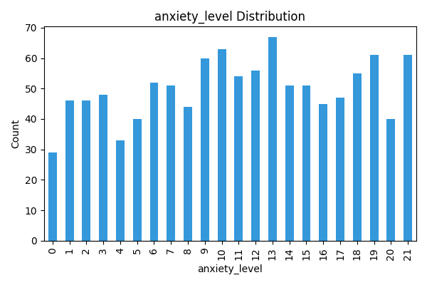
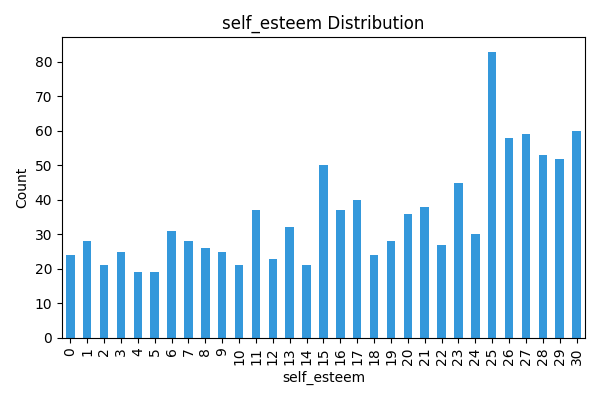
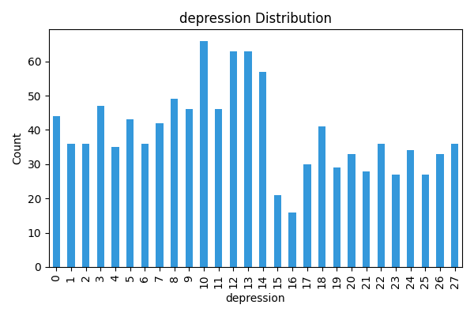
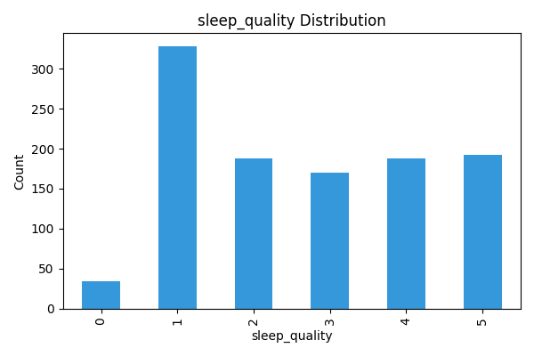
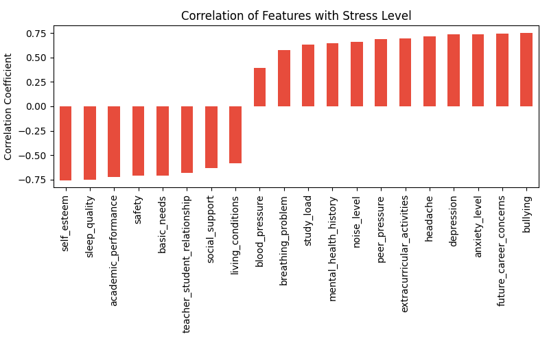

# 📊 Student Stress Analyzer

A simple, practical data project to explore **student stress** using Python. It covers:
- Clean EDA (summary, missing values, top anxiety students)
- Clear visuals (distributions + correlations with stress)
- Reproducible outputs (saved to `outputs/`)

## 🚀 Tech
Python, Pandas, Matplotlib, Seaborn, (optional) scikit-learn.
Kaggle: [https://www.kaggle.com/code/gitanjalisoni/stress-analyzer]

## 📊 Visualizations

Here are the key graphs from the analysis:

1. **Stress Level Distribution**
   ## 📊 Visualizations

Here are the key graphs from the analysis:

1. **Stress Level Distribution**
   

2. **Self Esteem Distribution**
   

3. **Depression Distribution**
   

4. **Sleep Quality**
   

5. **Stress Correlation**
   
   
## 📑 Dataset
- **Student Stress Level Dataset** (Kaggle). [https://www.kaggle.com/datasets/mdsultanulislamovi/student-stress-monitoring-datasets].

## ⚙️ Setup
```bash
1) create & activate venv
python -m venv .venv
# Windows
.venv\Scripts\activate

# 2) install deps
pip install -r requirements.txt

▶️ Run
python main.py
